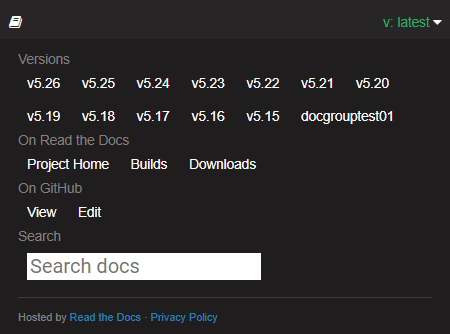

<h2 style="margin-bottom:1.25em;">User Guides for the latest version</h2>

User guides for this version are available via the left navigation.

At the top of each page there is a link to the corresponding markdown file in the GitHub source repository, via which visitors can easily propose documentation updates.

<h2 style="margin-top:1.25em; margin-bottom:1.25em;"> Previous User Guides</h2>

To access user guides for previous versions of the software, click the small flyout menu banner in the bottom right of the website:

Clicking the banner opens a pane with a link to all the previous versions.

